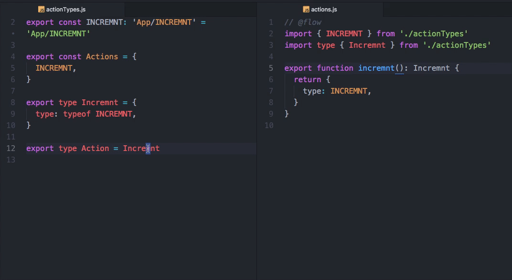

# s2s-examples
  

## ShoppingCart
React+redux+flowtype

## Contributors

Thanks goes to these wonderful people ([emoji key](https://github.com/kentcdodds/all-contributors#emoji-key)):

<!-- ALL-CONTRIBUTORS-LIST:START - Do not remove or modify this section -->
| [ akameco](http://akameco.github.io) [💻](https://github.com/akameco/s2s-examples/commits?author=akameco "Code") [📖](https://github.com/akameco/s2s-examples/commits?author=akameco "Documentation") [⚠️](https://github.com/akameco/s2s-examples/commits?author=akameco "Tests") [🚇](#infra-akameco "Infrastructure (Hosting, Build-Tools, etc)") | [ elzup](https://elzup.com) [💻](https://github.com/akameco/s2s-examples/commits?author=elzup "Code") |
| :---: | :---: |
<!-- ALL-CONTRIBUTORS-LIST:END -->

This project follows the [all-contributors](https://github.com/kentcdodds/all-contributors) specification. Contributions of any kind welcome!

## License

MIT © [akameco](http://akameco.github.io)
